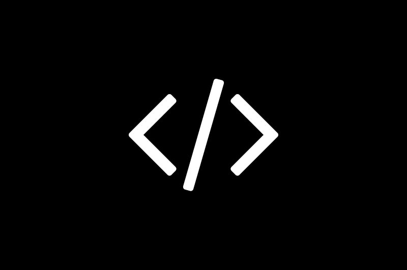

    
    

        <h1>Brent De Roeck</h1>
        

            
I’m a starting web developer that is very enthusiastic about his work. I love design and code and am very passionate about what I do. I am currently studying at the Artevelde University College in Ghent. My Specialization is New Media Development. I specialize in Web Design and development but have learned some other skills along the way. I’m very open for learning more skills and participating in projects that require me to learn new stuff. I see myself as a hard worker that is very passionate about what he does. 
            

            

                I have done a few projects and have a little work experience. A couple of projects related to school and a couple of projects that I did for people needing a website for their business. Thank you for visiting my website and reading about me. Feel free to snoop around or contact me when you have a question.
            

        

    

    <h1>My work</h1>
    



<a href="{{ work.url }}" target="_blank">{{ work.name }}</a>


    

